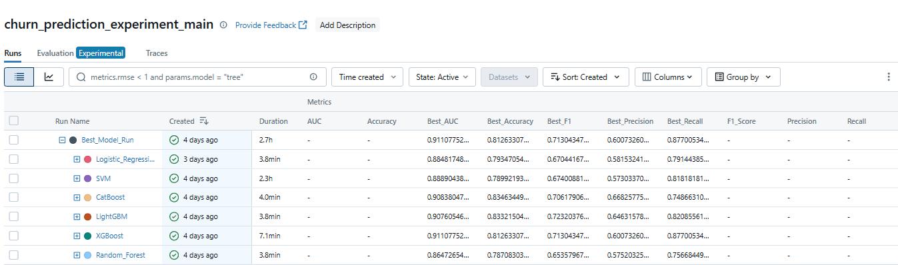

# 🧠 Customer Churn Prediction using MLOps, MLflow, Docker, AWS, CI/CD, Heroku

Predict whether a customer will churn from a telecom company using end-to-end **Machine Learning + MLOps practices**.

This project uses:
- ML models with Optuna hyperparameter tuning
- MLflow for experiment tracking
- DagsHub for version control and remote DVC & MLflow hosting
- CI/CD pipelines (GitHub Actions)
- Docker for environment reproducibility
- Deployment on **Heroku** and **AWS EC2**
- Automated testing using PyTest

---

## 📹 Project Demo

Add your recorded project walkthrough/demo video here:

**App Link**: [Watch Demo](https://customer-churn-prediction-11x8.onrender.com)
**App Link**: [Watch Demo](https://huggingface.co/spaces/NihalNiair/customer_churn_app_cicd)

**YouTube Link**: [Watch Demo](https://youtube.com/...)


---

## 🚀 Project Architecture

```bash
├── .github/workflows         # CI/CD pipelines for AWS and Heroku
│   ├── ci_cd_aws.yaml         
│   └── ci_cd_heraku.yaml
├── Dockerfile                # Docker container definition
├── data                      # Source code package
│   ├── raw/                  
│   └── processed/
├── catboost_info/  
├── artifacts/                # Saved artifacts (train/test files), also cuntains the model.pkl
├── notebooks/                # EDA, model tuning, reports
├── src/                      # Source code package
│   ├── components/           # Data ingestion, transformation, training
│   ├── utils/                # Utility functions
│   ├── pipeline/             # Pipeline orchestration
│   ├── logger.py             # Logging code
│   ├── utils.py              # Utilities
│   └── exception.py          # Custom exceptions
├── tests/                    # Unit tests
├── requirements.txt
├── README.md
├── .dockerignore
├── .gitignore
├── dockerfile
├── requirements.txt
├── setup.py
└── app.py                    # Streamlit app
````

---

## 📌 Project Objective

This project aims to identify customers likely to **churn** using key attributes such as:

* Demographic info
* Contract details
* Monthly charges
* Internet service

You can use this project to:

* Practice **end-to-end MLOps**
* Learn model tracking with **MLflow**
* Deploy ML models with **Docker**, **Heroku**, or **AWS**
* Implement **CI/CD workflows** for training + deployment

---

## 🧠 Best Model & Experiment Tracking (MLflow)

* 🔍 **Model Used**: `XGBoost`
* 🧪 **Hyperparameter Tuning**: Performed using `Optuna`
* 🧪 **No. of Trials**: `30`
* 🔁 **Cross Validation**: `5-Fold Stratified K-Fold`
* 🥇 **Best AUC Score**: `0.91`

### 📷 Screenshot placeholder

> Paste your MLflow screenshot here:



📎 **MLflow Tracking UI (hosted on DagsHub)**
[🔗 MLflow UI Link](https://dagshub.com/Niair/Customer_Churn_Prediction_using_MLOpps_MLflow_AWS_CI-CD.mlflow/#/experiments/40?searchFilter=&orderByKey=attributes.start_time&orderByAsc=false&startTime=ALL&lifecycleFilter=Active&modelVersionFilter=All+Runs&datasetsFilter=W10%3D)

---

## 🐳 Docker Instructions

### 🔧 Build Docker Image

```bash
docker build -t churn-prediction .
```

### ▶️ Run Docker Container

```bash
docker run -p 5000:5000 churn-prediction
```

### 📥 Pull Prebuilt Image from DockerHub

```bash
docker pull niair/customer_churn_app
```

---

## ☁️ Deployment Instructions

### 🔹 Heroku Deployment

1. Install Heroku CLI
2. Login using `heroku login`
3. Push code to Heroku Git
4. App will automatically be deployed via CI/CD pipeline

---

### 🔸 AWS EC2 Deployment

1. Create EC2 instance
2. SSH into instance
3. Clone repo and run Docker container:

```bash
git clone https://github.com/<your_username>/Customer_Churn_Prediction_with_MLOps.git
cd Customer_Churn_Prediction_with_MLOps
docker build -t churn-prediction .
docker run -p 5000:5000 churn-prediction
```

---

## 🔁 CI/CD

CI/CD pipelines are configured using **GitHub Actions** in:

```
.github/workflows/
├── cicd_heroku.yml
├── cicd_aws.yml
```

These handle:

* ✅ Code testing via PyTest
* 🔁 Docker image build & push
* 🚀 Automatic deployment to Heroku/AWS

---

## 🧪 Running Tests

Tests are written using `pytest`. Run them using:

```bash
pytest tests/
```

---

## 🔗 Clone & Fork

### 🔁 Fork this repo

Click on the top-right **"Fork"** button on GitHub.

### ⬇️ Clone locally

```bash
git clone https://github.com/<your_username>/Customer_Churn_Prediction_with_MLOps.git
cd Customer_Churn_Prediction_with_MLOps
```

### 🔄 Sync fork

```bash
git remote add upstream https://github.com/Niair/Customer_Churn_Prediction_with_MLOps.git
git fetch upstream
git merge upstream/main
```

---

## 🤝 Contributing

Pull requests are welcome! For major changes, please open an issue first to discuss what you would like to change.

---

## 🙋 Contact

* **Author**: Nihal
* **GitHub**: [@Niair](https://github.com/Niair)

```
